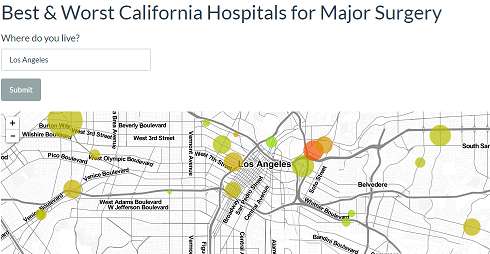
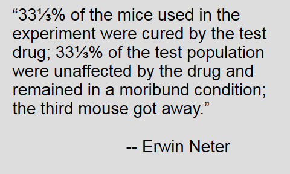
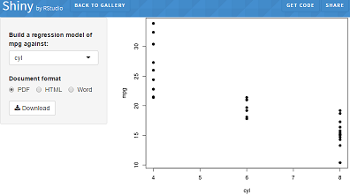

<style type="text/css">

slides > slide:before {
  font-size: 12pt;
  content: 'http://shiny.rstudio.com/';
  position: absolute;
  text-align: center;
  bottom: 15px;
  left: 50%;  
  margin-left: -300px;
  width: 600px;
  line-height: 1.9;
}

div.img-col{
  text-align: center;
  font-size: 14pt;
}

a {
  border-bottom: none !important;
}

.wrapper {
  margin: 70px auto;
  position: relative;
  z-index: 90;
}

.ribbon-wrapper-green {
  width: 145px;
  height: 148px;
  overflow: hidden;
  position: absolute;
  top: -3px;
  right: -3px;
}

.ribbon-green {
  font: bold 15px Sans-Serif;
  color: #333;
  text-align: center;
  text-shadow: rgba(255,255,255,0.5) 0px 1px 0px;
  -webkit-transform: rotate(45deg);
  -moz-transform:    rotate(45deg);
  -ms-transform:     rotate(45deg);
  -o-transform:      rotate(45deg);
  position: relative;
  padding: 7px 0;
  left: -25px;
  top: 45px;
  width: 220px;
  background-color: #7ADCBF;
  background-image: -webkit-gradient(linear, left top, left bottom, from(#8AACDF), to(#658FBE)); 
  background-image: -webkit-linear-gradient(top, #8AACDF, #658FBE); 
  background-image:    -moz-linear-gradient(top, #8AACDF, #658FBE); 
  background-image:     -ms-linear-gradient(top, #8AACDF, #658FBE); 
  background-image:      -o-linear-gradient(top, #8AACDF, #658FBE); 
  color: #6a6340;
  -webkit-box-shadow: 0px 0px 3px rgba(0,0,0,0.3);
  -moz-box-shadow:    0px 0px 3px rgba(0,0,0,0.3);
  box-shadow:         0px 0px 3px rgba(0,0,0,0.3);
}

.ribbon-green:before, .ribbon-green:after {
  content: "";
  border-top:   3px solid #00896e;   
  border-left:  3px solid transparent;
  border-right: 3px solid transparent;
  position:absolute;
  bottom: -3px;
}

.ribbon-green:before {
  left: 0;
}
.ribbon-green:after {
  right: 0;
}
</style>

# Session Outline

## Session Goals

### You will learn:
- An Overview of R Markdown & HTML Widgets
- How to add HTML Widgets to R Markdown Reports/Dashboards
- An Introduction to Reporting in R Markdown Reports
- New DB Landscape

## Outline

### We'll Cover Five Main Areas:
<div class="columns-2">
- R & Setup
- R Markdown
- HTML Widgets
- Flexdashobard
- Databases

<div class="img-col">

   
 </div>
</div>

## My Story & How I Got Here
### About:
 - CS Background
 - Hoosier
 - IU, IBM, RStudio

## Goal of Workshop

<div class="columns-4"></a>

- Target Audience
- Goal of session

</div>


# Part 1 Setup

## Setup

- R
- Packages
- IDE
- Projects
- Sessions
- Git/Github
- RSC
- Shiny
- Repeatable & Reproducible

## IDE PICK A DATASET

- Built-in datasets
- data()
- data(ToothGrowth)
- ?ToothGrowth
- ToothGrowth
- View(ToothGrowth)
- ToothGrowth %>% View("TG")
- summary(ToothGrowth)
- plot(ToothGrowth)

## IDE LET’S EXPLORE...
- getwd()
- installed.packages()
- .libPaths()
- Install a package...how about one from here:
- https://gallery.shinyapps.io/087-crandash/
- install.packages("here")
- here::here("data","raw-data.csv")
- User library
- System library
- https://juliasilge.com/blog/navigating-packages/

## IDE LET’S EXPLORE More...
- library(tidyverse)
- https://support.rstudio.com/hc/en-us/articles/215733837-Managing-libraries-for-RStudio-Server
- https://cran.r-project.org/doc/manuals/r-release/R-admin.html#Managing-libraries
- In shell, run "tree"

## Let us explore a data set a bit
- names(ToothGrowth) # names of the variables
- dim(ToothGrowth) # dimension (number of rows and columns)
- str(ToothGrowth) # structure of the data set
- class(ToothGrowth)
- head(ToothGrowth, n = 5)
- tail(ToothGrowth, n = 5)
- ToothGrowth%>% write_csv('ToothGrowth.csv')
- ToothGrowth2 <-read_csv("ToothGrowth.csv")

## DATATYPES
- R has a wide variety of data types…
- Vectors
- Lists
- Matrix
- Factors
- Data frame
- Tibble

## WHAT I LIKE ABOUT TIBBLES..

<div class="columns-2">
- The pet cat -no
- Timmy and Tommy Tibble –no but my kids do…
- An awesome data set format for R: yes
- [Tibble info](http://colorado.rstudio.com/rsc/content/678/tidyverse_notebook.nb.html)

 <div class="img-col">
   
   
   <div>CC image courtesy <br /> of <a href="http://pbskids.org/arthur/friends/tibbles/photos.html">pbskids</a> arthur</div>
 </div>
</div>

## Tribbles!..

<div class="columns-2">
- Another way to create a tibble is with tribble(), short for transposed tibble
- http://r4ds.had.co.nz/tibbles.html

 <div class="img-col">
   
   
   <div>CC image courtesy CBS Home Entertainment<br /> of <a href="http://www.treknews.net/2017/07/31/star-trek-discovery-tribbles-pg13/">The Trouble </a> With Tribbles</div>
 </div>
</div>

## Tibble Example

```{r}
library(tibble)
#library("tidyverse")
storms <-tribble(
~storm, ~wind, ~pressure, ~date,
"Alberto", 110, 1007, "2000-08-12",
"Alex", 45, 1009, "1998-07-30",
"Allison", 65, 1005, "1995-06-04",
"Ana", 40, 1013, "1997-07-01",
"Arlene", 50, 1010, "1999-06-13",
"Arthur", 45, 1010, "1996-06-21"
)

# filter(storms, wind == 45)

```


# Part 2 R Markdown

## Development Process
- ["I created a quick plot, that then turned into a R Notebook, that then turned into an interactive dashboard."](https://www.linkedin.com/pulse/its-nonlinear-world-interactive-dashboard-edgar-ruiz/)

## R Markdown Examples

<div class="columns-2">
- [Time Gained in Flight](https://spark.rstudio.com/examples/yarn-cluster-emr/#build-dashboard)
- [Monitor Clinical Research](https://jenthompson.me/2018/02/09/flexdashboards-monitoring/)
- [Explore Predictive Maintenance with flexdashboard](https://blog.codecentric.de/en/2017/11/explore-predictive-maintenance-flexdashboard/)
- [Cancer prediction using caret by JESUS M. CASTAGNETTO](https://rpubs.com/jesuscastagnetto/caret-knn-cancer-prediction)
- [Dashboards made easy](https://www.rstudio.com/resources/videos/dashboards-made-easy)

<div class="img-col">
 </div>

</div>

## R Markdown - Benefits & Features

<div class="columns-2">
 - Markdown is a particular type of markup language.
 - Markup languages are designed produce documents from plain text.
 - Existing R code can be used within R Markdown & reports can be parameterized
 - Easy creation of dynamic documents, presentations, and reports
 - Framework for writing reproducible reports from R
 
<div class="img-col">
   
 </div>
</div>

## What can I do with RMD?

- Write a book http://adv-r.had.co.nz/
- Write a blog https://rviews.rstudio.com
- Create a website http://rmarkdown.rstudio.com/
- Add a vignette to a package http://yihui.name/knitr/demo/vignette/
- Publish research https://github.com/rstudio/rticles
- Automate reporting https://github.com/philbowsher/Job-Scheduling-R-Markdown-Reports-via-R
- Preserve your sanity and look back at your workflow
- Make PowerPoints https://github.com/nwstephens/rmd2ppt

## Using R Markdown - How to Build a Document - Installation & Structure

 - Comes installed with the RStudio IDE
 - File Template - within RStudio
 - ["Add R code - Code Chunks"](http://rmarkdown.rstudio.com/authoring_rcodechunks.html) 
 - 
 - ["R Markdown Cheat Sheet"](http://shiny.rstudio.com/articles/rm-cheatsheet.html) 
 - Enhance with Shiny functions and R code
 - Utilize Chunk Options - echo=FALSE, results="hide", include=FALSE, warning=FALSE & message=FALSE 
 - Global chunk options
 
## Example R Markdown Doc -- `0_RMD_HelloWorld`

- Create a new R Markdown document in the IDE by going to 'File' and select 'New File' and select 'R Markdown...' and create a new document and leave output as HTML
<div class="columns-4"></a> </div>

- Then select Knit and save it as Example.RMD </td>
<td></td>
</tr>
</table>

## rmarkdown::render -- `1_RMD_Stocks`

- rmarkdown::render(“Stocks.Rmd”, params = list(symbol=‘IBM’))
- https://beta.rstudioconnect.com/content/3132/Job_Scheduling_R_Markdown_Reports_via_R.html


## Common Reporting Tasks -- `2_RMD_GGplot2`

<div class="columns-2">
- [Plotting system for R](https://rpubs.com/hadley/ggplot2-toolbox)
- [Created by Hadley Wickham](http://ggplot2.org/)
- [Powerful graphics language for creating elegant and complex plots](http://www.cookbook-r.com/Graphs/)
- [ggplot2 is a graphing library for R. Use ggplot2 with Plotly to create interactive, online ggplot2 charts with D3.js.](https://plot.ly/ggplot2/)
- [ggvis is a data visualization package for R](http://ggvis.rstudio.com/)

<div class="img-col">
<a href="https://ramnathv.github.io/pycon2014-r/visualize/ggplot2.html"></a>


</div>

## A ggplot2 template - Make any plot by filling in the parameters of this template

```{r}
#ggplot(data = <DATA>) +
#<GEOM_FUNCTION>(mapping = aes(<MAPPINGS>))
```

```{r fig.height = 3, fig.width = 5}
library(ggplot2)
ggplot(data = mpg) +
geom_point(mapping = aes(x = displ, y = hwy))
```


# Genius of R Markdown...

## Part 2.0 - R Notebooks -- `0_RMD_Notebook_HelloWorld.RMD`

<div class="columns-2">
- [Notebooks](http://rmarkdown.rstudio.com/r_notebooks.html)
- [Notebook Background](https://rviews.rstudio.com/2017/03/15/why-i-love-r-notebooks/)
- Leonardo da Vinci…Page from the Codex Atlanticus shows notes and images about water wheels and Archimedean Screws
- Combine in a single document: Narrative, Code, Output & then Render to HTML

<div class="img-col">
<a href="https://blog.rstudio.com/2016/10/05/r-notebooks/"></a>

</div>

## Part 2.0 - R Notebooks cont. -- `3_RMD_Notebook_Tidyverse`

<div class="columns-2">
- Number 3: Notebooks are for doing science
- Number 2: R Notebooks have great features
- Number 1: R Notebooks make it easy to create and share reports
- http://r4ds.had.co.nz/r-markdown-workflow.html

<div class="img-col">
<a href="http://rmarkdown.rstudio.com/r_notebooks.html#saving_and_sharing"></a>

</div>


# Part 3 HTML Widgets

## Live HTML Widgets Examples

<div class="columns-2">
- [The Distribution of National Top Universities in Each State](https://rpubs.com/ChengGaryGuo/350645)
- [Best & Worst California Hospitals for Surgery by Gary Chung](https://gchung.shinyapps.io/CAhospitals/)
- [Access to Hospital Care Dashboard ](http://colorado.rstudio.com:3939/content/188/)

<div class="img-col">
 </div>

</div>

## HTML Widgets R Bindings to JavaScript Libraries

<div class="columns-2">

- Used at the R console for data analysis just like conventional R plots (via RStudio Viewer).
- Seamlessly embedded within R Markdown documents and Shiny web applications.
- Saved as standalone web pages for ad-hoc sharing via email, Dropbox, etc.

<div class="img-col"><a href="http://www.htmlwidgets.org/index.html"></a>
 </div>
 
</div>

## Common Reporting Tasks - rpivotTable & DT

<div class="columns-2">
- [rpivotTable - Package created by Enzo Martoglio](https://github.com/smartinsightsfromdata/rpivotTable/blob/master/inst/examples/sorting.R)
- [DT: An R interface to the DataTables library by RStudio](https://rstudio.github.io/DT/)

<div class="img-col"><a href="http://hafen.github.io/htmlwidgetsgallery/"></a>
   
 </div>
</div>

</div>

## HTML Widgets &mdash; Leaflet Example -- `1_htmlwidgets_Leaflet_Starbucks`

<div class="columns-2">
<a href="http://www.htmlwidgets.org/showcase_leaflet.html"></a>

- [Leaflet Example ](http://rstudio.github.io/leaflet/)
- [Viewing Starbucks Locations Near us](https://opendata.socrata.com/Business/All-Starbucks-Locations-in-the-US-Map/ddym-zvjk)
- [Loads a Data Set](https://opendata.socrata.com/) 

</div>


## rbokeh Example -- `2_htmlwidgets_Indy_Bike_Stations`

- [Bike Share Stations ](http://data.indy.gov)
- [rbokeh gmap](http://ryanhafen.com/blog/rbokeh-gmap)


<div class="columns-4"></a> </div>

## Starbucks & Bike Stations

- Tidyverse - Power of R
- 3_htmlwidgets_Starbucks_Bike


## Dygraphs Example -- `4_htmlwidgets_Indy_Unemployment`

- [FRED® Economic Data](https://fred.stlouisfed.org/series/WASH911UR/downloaddata)
- [quantmod](http://www.quantmod.com/examples/intro/)
- [R interface to the dygraphs JavaScript charting library... It provides rich facilities for charting time-series data in R](http://rstudio.github.io/dygraphs/)

<div class="columns-4"></a> </div>

## Dygraphs Example -- `5_htmlwidgets_Indy_Stocks`

- [Largest Indiana Public Companies](https://www.ibj.com/largest_indiana_public_companies)
- Anthem Inc., Indianapolis
- Eli Lilly and Co., Indianapolis
- Cummins Inc., Columbus

<div class="columns-4"></a> </div>


## You Need a Dashboard!

<div class="columns-4"></a>

</div>


# Part 4 The Evolution of R Markdown

## Before Flexdashboard

- R Markdown templates... Typically HTML is modified with an R package
- Can also be modified directly in the YAML header with your own styles.css file
- Here is a R package with prebaked CSS... https://github.com/nwstephens/rmdcss
- https://rmarkdown.rstudio.com/html_document_format.html#custom_css
- https://raw.githubusercontent.com/rstudio/seamonster/master/rmarkdown/parameterized-stock/parameterized-flexdashboard-stock.Rmd
- https://rmarkdown.rstudio.com/developer_document_templates.html
- http://markdowncss.github.io/
- https://github.com/yixuan/prettydoc/

## Intro to RMD - flexdashboard - Create Data Visualizations as a Dashboard

<div class="columns-2">
- [flexdashboard](http://rmarkdown.rstudio.com/flexdashboard/)
- [Gene Expression Biclustering - Bryan Lewis](https://jjallaire.shinyapps.io/shiny-biclust/)
- [Iris K-Means Clustering](https://jjallaire.shinyapps.io/shiny-kmeans/)

<div class="img-col">
<a href="https://jjallaire.shinyapps.io/shiny-biclust/"></a>

</div>

## HTML Widgets &mdash; Dygraphs in RMarkdown

<div class="columns-2">
<a href="https://beta.rstudioconnect.com/jjallaire/htmlwidgets-dygraphs/"></a>

- [flexdashboard Example](http://rmarkdown.rstudio.com/flexdashboard/)
- 3_RMD_Flex_Indy_Stocks

</div>

## flexdashboard Combining htmlwidgets -- `Indy Coders Dashboard`

- 4_RMD_Flex_DB
- R Markdown - From Template
- Other examples here... https://github.com/philbowsher/dashboards-RMD-session-2017-08-24

## R Markdown Websites

 - [Site](http://rmarkdown.rstudio.com/rmarkdown_websites.html)
 - [Example](https://beta.rstudioconnect.com/content/2675/about.html)
 - https://github.com/philbowsher/Stocks-RMarkdown-Website
 
# Generating Various Versions of a Dashboard

## rmarkdown::render -- `1_RMD_Stocks`

- rmarkdown::render(“Stocks.Rmd”, params = list(symbol=‘IBM’))
- https://beta.rstudioconnect.com/content/3132/Job_Scheduling_R_Markdown_Reports_via_R.html
- 6_RMD_Report_Versions


## Hopefully Not in this room...

<div class="columns-4"></a>

</div>


# Part 5 Databases - Generating Dashboard from database data

## Databases - Connect R to	your data

- Explore your databases using the RStudio IDE
- Develop and deploy Shiny applications	that connect on databases
- Learn best practices for using R with	your databases
- Connection	Wizard
- Connections	Tab
- https://blog.rstudio.com/2017/08/16/rstudio-preview-connections/
- https://github.com/rstudio/bigdataclass2018/blob/master/01-database-access.Rmd
- https://github.com/edgararuiz/db_best_practices_2018
- http://colorado.rstudio.com/rsc/bigdata/access-a-database.html#connect-to-a-database

## Landscape

- DBI
- dplyr
- dbplyr [New!]
- odbc [New!]
- http://db.rstudio.com/
- https://github.com/edgararuiz/db_best_practices_2018

## DB - Three	ways to write	queries
- DBI	code
- dplyr syntax
- R	Notebook	SQL	language	engine

## Database R Markdown Dashboard
- 6_RMD_Combined_DB
- https://rviews.rstudio.com/2017/10/18/database-queries-with-r/
- https://community.rstudio.com/t/why-does-rstudio-documentation-recommend-odbc-vs-jdbc-drivers/2381/5


# Part 6 Deploying

## So where can I deploy my R Markdown dashboards?
- R Markdown websites are static HTML pages that can be deployed to any standard web server
- Via email
- GitHub Pages
- Amazon S3 or EC2
- Rpubs
- beta.rstudioconnect.com
- http://alignedleft.com/resources/cheap-web-hosting


# So What's Next...Shiny


## Shiny Motivation

<div class="columns-2">
 - Analysis must be communicated
 - Data scientists are modern diviners
 - We sit between the tools and users
 - Deliver static reports
 - Impoverished perspective into analysis

 <div class="img-col">
   
   
   <div>Altered CC image courtesy <br /> of <a href="https://www.flickr.com/photos/mcgraths/">mcgraths</a> on flickr</div>
 </div>
</div>


## Shiny
### About:
 - Interactive web application framework for R
 - Create and share applications with others
 - Expects no knowledge of web technologies like HTML, CSS, or JavaScript (but you can leverage them, if you know them)

### Benefits & Features:
 - Accessible to non-programmers
 - Great for exploratory data analysis, visualizations & dashboards
 - Utilize existing R code
 
## Using Shiny - How to Build a shiny App & Installation & Structure
 - A shiny app consists of two parts: a user interface (UI) and a server
 - Install Package - Shiny - install.packages("shiny")
 - Load Library - Shiny - library(shiny)
 - ui.R - User Interface
 - server.R  - Server Function
 - File Template - runExample("01_hello")
 - [Shiny Cheat Sheet](http://shiny.rstudio.com/articles/cheatsheet.html)
- [Enhance with Shiny functions and R code](http://shiny.rstudio.com/reference/shiny/latest/)
- [Enhance with Shiny Widgets](http://shiny.rstudio.com/gallery/widget-gallery.html)

## Intro Process
- https://shiny.rstudio.com/articles/build.html
 - https://github.com/rstudio/shiny-examples/
 - http://shiny.rstudio.com/gallery/single-file-shiny-app.html
 - Panels
 - ToothGrowth
 - http://shiny.rstudio.com/gallery/basic-datatable.html
 - http://shiny.rstudio.com/gallery/reactivity.html
 
## HTML Widgets &mdash; Leaflet Example - 2_htmlwidgets_Shiny_Leaflet_Starbucks

<div class="columns-2">
<a href="http://www.htmlwidgets.org/index.html"></a>

- How would you add Shiny to it?
- Find Starbuck locations for your hometown...

</div>

## Example shiny App &mdash; `ui.R`

```r
library(datasets)
library(DT)

fluidPage(
  titlePanel("Basic DataTable for ToothGrowth"),
  
  # Create a new Row in the UI for selectInputs
  fluidRow(
    column(4,
           selectInput("supp",
                       "Supplement:",
                       c("All",
                         unique(as.character(ToothGrowth$supp))))
    )
    )
  ,
  # Create a new row for the table.
  fluidRow(
    DT::dataTableOutput("table")
  )
)
```

```{r, echo=FALSE, results="hide"}
library(datasets)
head(iris, n=2)
```


## Example shiny App &mdash; `server.R`

```r
library(datasets)

function(input, output) {
  
  # Filter data based on selections
  output$table <- DT::renderDataTable(DT::datatable({
    data <- ToothGrowth
    if (input$supp != "All") {
      data <- data[data$supp == input$supp,]
    }
    data
  }))
  
}
```

## Shiny Development Example - 1_Shiny_ToothGrowth_Basic

- Go [here](http://shiny.rstudio.com/gallery/basic-datatable.html)
- Create a new multi file shiny app in the IDE by going to 'File' and select 'New File' and select 'Shiny Web App...' and create a new multiple file app and title it 'clustering'
- Copy over the ui.R and app.R files with the code found [here:](https://github.com/rstudio/shiny-examples/tree/master/030-basic-datatable)
- Click 'Run App' in the IDE when done

## Shiny Example - Interactive Plot ToothGrowth 2_Shiny_Basic_Plots
```{r, echo=FALSE}
library(ggplot2)
library(Cairo)   # For nicer ggplot2 output when deployed on Linux
library(datasets)

dataset <- ToothGrowth

ui <- fluidPage(
  fluidRow(
    
    column(width = 6,
           plotOutput("plot1", height = 350,
                      click = "plot1_click",
                      brush = brushOpts(
                        id = "plot1_brush"
                      )
           ),
           actionButton("exclude_toggle", "Toggle points"),
           actionButton("exclude_reset", "Reset")
    )
  )
)

server <- function(input, output) {
  # For storing which rows have been excluded
  vals <- reactiveValues(
    keeprows = rep(TRUE, nrow( dataset))
  )
  
  output$plot1 <- renderPlot({
    # Plot the kept and excluded points as two separate data sets
    keep    <-  dataset[ vals$keeprows, , drop = FALSE]
    exclude <-  dataset[!vals$keeprows, , drop = FALSE]
    
    ggplot(keep, aes(dose, len)) + geom_point() +
      geom_smooth(method = lm, fullrange = TRUE, color = "black") +
      geom_point(data = exclude, shape = 21, fill = NA, color = "black", alpha = 0.25) +
      coord_cartesian(xlim = c(0.5, 2.0), ylim = c(5,35))
  })
  
  # Toggle points that are clicked
  observeEvent(input$plot1_click, {
    res <- nearPoints( dataset, input$plot1_click, allRows = TRUE)
    
    vals$keeprows <- xor(vals$keeprows, res$selected_)
  })
  
  # Toggle points that are brushed, when button is clicked
  observeEvent(input$exclude_toggle, {
    res <- brushedPoints( dataset, input$plot1_brush, allRows = TRUE)
    
    vals$keeprows <- xor(vals$keeprows, res$selected_)
  })
  
  # Reset all points
  observeEvent(input$exclude_reset, {
    vals$keeprows <- rep(TRUE, nrow( dataset))
  })
  
}

shinyApp(ui, server)
```

## Shiny Development Example - 3_Shiny_ToothGrowth_Plots

<div class="columns-2">
- [Example 1](http://shiny.rstudio.com/gallery/plot-interaction-exclude.html)
- [Example 2](http://shiny.rstudio.com/gallery/plot-plus-three-columns.html)


</div>

# Part 2 - shinydashboard

## Interactive-Reporting-Dashboards-in-Shiny

- [Interactive-Reporting-Dashboards-in-Shiny](https://github.com/philbowsher/Interactive-Reporting-Dashboards-in-Shiny)
- [Interactive plots](http://shiny.rstudio.com/gallery/)
- [1_Shiny_Basic_Plots](http://shiny.rstudio.com/gallery/plot-interaction-exclude.html)

## Shiny Development Example - 4_Shiny_shinydashboard_basic

- [How to develop a Shiny dashboard](http://db.rstudio.com/best-practices/dashboards/)
- [Intro to dashboards](https://github.com/rstudio/bigdataclass2018/blob/master/assets/workbook/09-dashboards.Rmd)
- [Pharmacometrics: some Shiny applications](http://webpopix.org/shiny/ShinyExamples.html)
- [CDC PrEP Guidelines](https://prism.shinyapps.io/cdc-prep-guidelines/)
- [CDC Zika Data](https://chendaniely.shinyapps.io/zika_cdc_dashboard/)
- [shinydashboard](https://rstudio.github.io/shinydashboard/)
- 4_Shiny_shinydashboard_basic
- [Material design in Shiny apps](https://ericrayanderson.github.io/shinymaterial/)


## Shiny Development Example - 4_Shiny_Immunogenicity_3Tier

- shinydashboard
- ADA three‐tiered testing strategy is deployed to assess ADA on sample data.
- [Example](https://beta.rstudioconnect.com/content/2769/)

## Shiny Development Example - 4_Shiny_Immunogenicity_htmlTemplate

- Simple Immunogenicity report via Shiny html template
- [HTML Templates](http://shiny.rstudio.com/articles/templates.html)
- [Developing and deploying large scale Shiny applications ](https://channel9.msdn.com/Events/useR-international-R-User-conferences/useR-International-R-User-2017-Conference/Developing-and-deploying-large-scale-Shiny-applications-for-non-life-insurance)
- [Example](https://beta.rstudioconnect.com/content/2771/)

## shiny Package & Shiny Server

<table width="100%" style="border-spacing: 50px; border-collapse: separate; margin: -50px auto;">
<tr>
<td style="vertical-align: top; padding-top: 1em">
### shiny Package
Shiny is an open source R package that provides a web framework for building interactive web applications using R.
</td>
<td></td>
</tr><tr>
<td style="vertical-align: top; padding-top: 1em">
### Shiny Server
Shiny Server is a server program that lets you host and manage shiny web applications and interactive documents online.
</td>
<td></td>
</tr>
</table>

## What Shiny functions are being used below?
```{r, echo=FALSE}
library(d3scatter)
library(crosstalk)

shared_ToothGrowth <- SharedData$new(ToothGrowth)
bscols(widths = c(3,NA,NA),
  list(
    filter_checkbox("supp", "supp", shared_ToothGrowth, ~supp, inline = TRUE),
    filter_slider("dose", "dose", shared_ToothGrowth, ~dose, width = "100%")
  ),
  d3scatter(shared_ToothGrowth, ~dose, ~len, ~factor(supp), width="100%", height=250),
  d3scatter(shared_ToothGrowth, ~len, ~dose, ~factor(supp), width="100%", height=250)
)
```


# Combining Shiny & R Markdown

## You see, right now, we have Relationship Shiny, but there is also Independent Shiny...

<div class="columns-4"></a>

https://beta.rstudioconnect.com/content/2671/Combining-Shiny-R-Markdown.html

</div>

## Shiny/R Markdown Examples

<div class="columns-2">
- [FDA Adverse (Drug) Event Dashboard](https://github.com/statwonk/openfda-dashboard)
- [interAdapt - An Interactive Planner for Group Sequential, Adaptive Enrichment Designs](https://michaelrosenblum.shinyapps.io/interAdapt/)
- [Export a report from Shiny - Simple Example](http://shiny.rstudio.com/gallery/download-knitr-reports.html)
 - [AplusB: A + B design investigator for phase I dose-escalation studies](https://graham-wheeler.shinyapps.io/AplusB/)

<div class="img-col">
   
 </div>
</div>

</div>

## R Markdown Document - Interactivity Using Shiny

 - R Markdown - leveraging Shiny
 - Using the Shiny `renderPlot` function to make a plot interactive
 - `selectInput` & `sliderInput` functions create the input widgets
 - You can also embed Shiny components directly within HTML presentations
 - It is also possible to embed an entire shiny application within an R Markdown document using the `shinyAppDir` function

## Example R Markdown Doc with Embed shiny App

 - In IDE - go to 'File', then 'New File' and 'R Markdown'
 - Then select 'Shiny' on the left and name the document
 - Click Ok
 - This is now an [interactive document](http://rmarkdown.rstudio.com/authoring_shiny.html)- an R Markdown file that contains Shiny components and can be an app or used within a report
 

 
 

 
 
 
 
 
 


## Q/A...

<div class="columns-4"></a>

</div>

## Additional Resources

 - Shiny Developer Center - http://shiny.rstudio.com
 - [Stack Overflow - "shiny" tag](http://stackoverflow.com/questions/tagged/shiny)
 - ["Shiny Discuss" Mailing List](https://groups.google.com/d/forum/shiny-discuss)
 - ***Come meet us!***
 
## Come see us at the RStudio Conference...

- [Austin January 15th through the 18th 2019](https://www.rstudio.com/conference/)
- https://github.com/rstudio/rstudio-conf/tree/master/2018

<div class="columns-4"></a>

</div>
